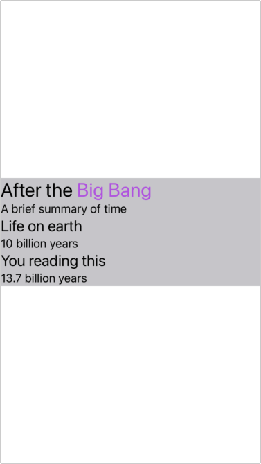

# AttributedText

AttributedText is a Swift µpackage that provides `NSAttributedString` rendering in SwiftUI by wrapping either an `NSTextView` or a `UITextView` depending on the platform.

## Supported Platforms

* macOS 11.0+
* iOS 14.0+
* tvOS 14.0+

## Usage
```swift
import AttributedText

struct ContentView: View {
    private let attributedString: NSAttributedString = {
        let result = NSMutableAttributedString(
            string: """
            After the Big Bang
            A brief summary of time
            Life on earth
            10 billion years
            You reading this
            13.7 billion years
            """
        )

        result.addAttributes([.font: UIFont.preferredFont(forTextStyle: .title1)], range: NSRange(location: 0, length: 18))
        result.addAttributes([.link: URL(string: "https://en.wikipedia.org/wiki/Big_Bang")!], range: NSRange(location: 10, length: 8))
        result.addAttributes([.font: UIFont.preferredFont(forTextStyle: .body)], range: NSRange(location: 19, length: 23))
        result.addAttributes([.font: UIFont.preferredFont(forTextStyle: .title2)], range: NSRange(location: 43, length: 13))
        result.addAttributes([.font: UIFont.preferredFont(forTextStyle: .body)], range: NSRange(location: 57, length: 16))
        result.addAttributes([.font: UIFont.preferredFont(forTextStyle: .title2)], range: NSRange(location: 74, length: 16))
        result.addAttributes([.font: UIFont.preferredFont(forTextStyle: .body)], range: NSRange(location: 91, length: 18))

        return result
    }()

    var body: some View {
        AttributedText(attributedString)
            .background(Color.gray.opacity(0.5))
            .accentColor(.purple)
    }
}
```



An `AttributedText` view takes all the available width and adjusts its height to fit the contents.

To change the text alignment or line break mode, you need to add a `.paragraphStyle` attribute to the attributed string.

## Installation
You can add AttributedText to an Xcode project by adding it as a package dependency.
1. From the **File** menu, select **Swift Packages › Add Package Dependency…**
1. Enter `https://github.com/gonzalezreal/AttributedText` into the package repository URL text field
1. Link **AttributedText** to your application target
